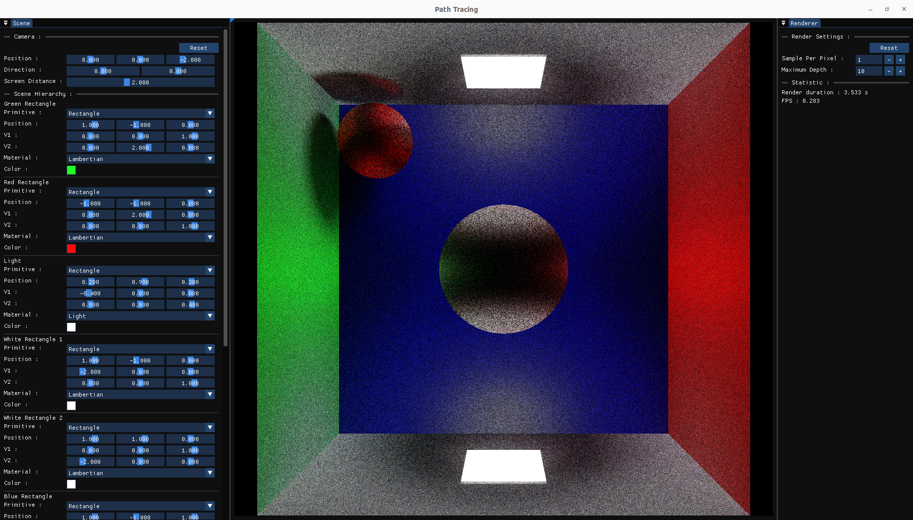

# PathTracing project



Master semester project. This program is a __C++__ implementation of a real time renderer with Path Tracing.

The software contains an editor of the scene as well as well as some rendering parameters. The viewport in the middle shows the result.

## Clone the repository

The repository needs submodules. To clone the repository properly, the following command has to be executed.

```
git clone --recursive git@github.com:Malkrich/PathTracing.git
```

## Build the project

### Linux

The project can be built on __Linux__ using __CMake__. In the root directory, the following commands can be executed in order to build the project :

- First a build directory has to be created
```
# Create a build directory
mkdir build

# Enter the build directory
cd build
```

- Then one of the following lines has to be chosen to run cmake with the right profile.
```
# Run CMake
cmake -DCMAKE_BUILD_TYPE=[Release | Debug] ..
```

- Then the program can be executed with the following lines.

```
# Execute the makefile
make

# Run the program
./PathTracing
```

### Windows

The program can also be built on __Windows__ using __Premake__ and __Visual Studio__. To build the project, double click on _Build_Windows.bat_. This will create a solution file (_.sln_) that can be then opened to run the program.

## Feature to be added

- Save the rendered image.
- Add / Remove elements in the scene
- Simplify the control of the elements in the scene
- Multithread the render of the scene to make it faster